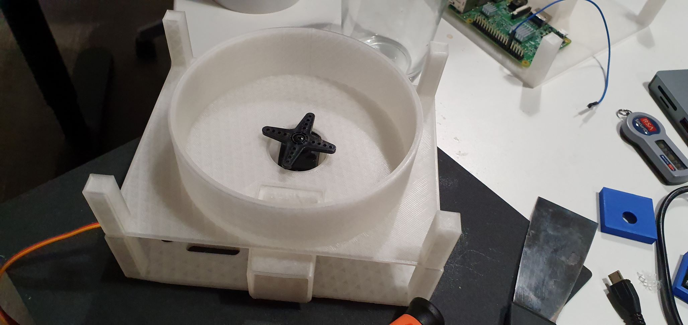
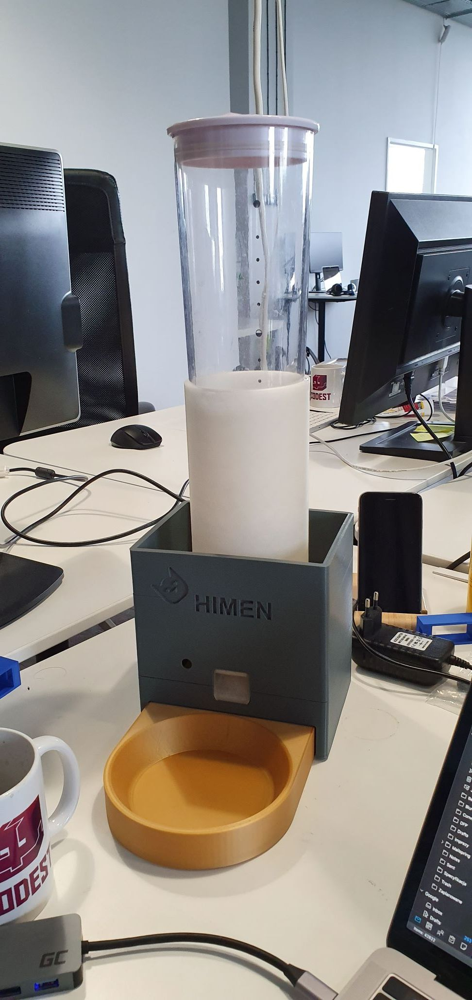
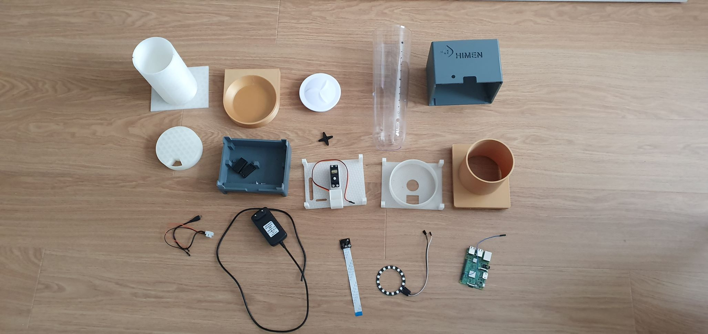
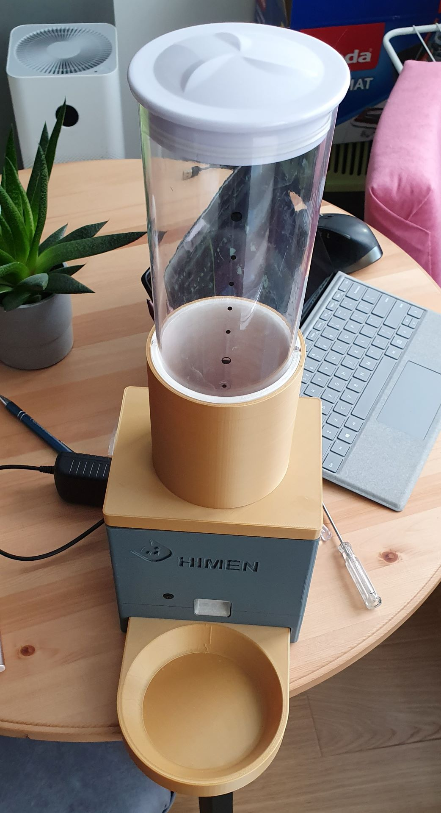

## Automatic Cat Feeder


So you are laying in the bed sleeping, it is 6:00 AM and you start hearing cat scratching on the door. I know what he wants. He needs food now because once upon time, in old days I given him a food at that time, and of course that became a new standard time for feeding. This situation gived me idea to build automatic cat feeder that would remove hassle of feeding from me.

### First generation

First generation of the cat feeder was simple MVP created using some cardboard, simple servo and ESP WeMos. It worked by using servo to rotate by 180 degres top container to dispense food.

<iframe width="960" height="415" src="https://www.youtube-nocookie.com/embed/XM9isy4HUUo" frameborder="0" allow="accelerometer; autoplay; encrypted-media; gyroscope; picture-in-picture" allowfullscreen></iframe>

Microcontroller connected to my local WiFi and communicated with Smart Home server running HomeAssistant over MQTT protocol. This gived me ability to use HomeAssistant automation system to schedule feeding and dispensing food using Google Home commands. Scheduling for feeding was defined as speciale events in Google Calendar, which gived me ability to easliy control feeding time. 

Of course this implementation have its problems:

* top container sometimes did break from servo handle and spilled whole food(i called this the jackpot effect)
* it was ugly
* cardboard started to deteriorate

As with most MVP it was used on production for 2 years until it broke.

### Second generation

I have decided, that next cat feeder should be:

* build with 3d printed parts
* use raspberry pi 3
* have small camera for looking what cat is doing

The design and build I have started from designing base for food paritioning. It was printed using Creality Ender-3 and PLA transparent filament:

<iframe width="960" height="315" src="https://www.youtube-nocookie.com/embed/3vbX-7o-h1c" frameborder="0" allow="accelerometer; autoplay; encrypted-media; gyroscope; picture-in-picture" allowfullscreen></iframe>

#### Parts
After ensuring that everything is working, I proceeded to design and print rest of parts:

##### Base for RaspberryPi (Level 0)


It has place for screws to install raspberry pi. Additionaly on front there is small hole to have easy access to RaspberryPi sd card.

##### Bowl holder

This plastic part is used for placing metal food bowl(of course it was printed using gold filament). It connects with base using 2 magnets


##### Servo holder (Level 1)

This level is used for holding servo while it rotates part on the next level, and it also has this small slope for food portion.


##### Ration mechanism container (Level 2)

This is just generic level that portions food from upper level using servo below. 



##### Food container holder (Level 3)

This part is used for holding food container. This is only plastic part that is not 3d printed.  The reasoning was that I wanted to minimize food contact with 3d printed parts. In theory used transparent PLA plastic, don't have any toxic parts, but just to be sure I bought the cheapest cereal dispenser and took the food container part. Also it looks cool.



##### Housing and lid

The last two parts were housing and lid. Nothing special here.


##### All parts



##### Final assembly



#### Software

Raspberry PI is running raspbian provisioned using [ansible playbook](https://github.com/macbury/SmartHouse/blob/master/provision/playbooks/cat_feeder/cat.yaml) to run these services:

##### MotionEye

Motioneye is opensource software for building your own private monitoring solution. It detects any camera connected to raspberry pi. Additionaly out of the box you get motion detection, endpoint for sharing stream and webhook support.

##### Servo service

This service controls rotation of the servo. It is simple python script that connects to MQTT server running my smart house software and awaits for message triggering rotation

##### Led service

As servo service, it implements protocol for light source controlled by mqtt in [HomeAssistant](https://www.home-assistant.io/integrations/light.mqtt/)

##### Home assistant automation

And finally the HomeAssistant automation that triggers feeding. It triggers feeding in two situations:

* if feeding time in calendar appears
* if international space station is above my home location

This automation looks like this:

```YAML
- alias: Feed the cat
  trigger:
    - platform: state
      entity_id: 'binary_sensor.iss'
      from: 'off'
      to: 'on'
    - platform: state
      entity_id: calendar.cat_feed_schedule
      from: 'off'
      to: 'on'
  action:
    - service: script.feed_the_cat

```