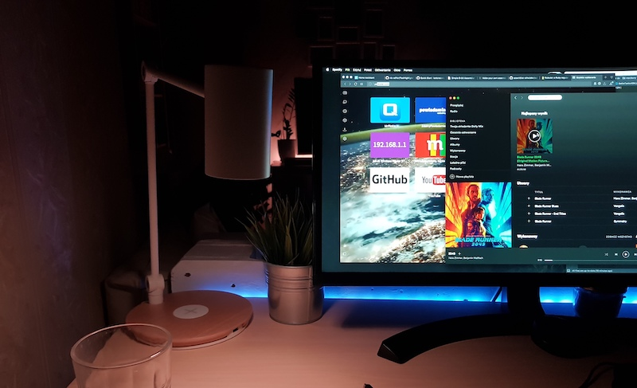

I always wanted smart lamp with wirless charging so I decided to modify my [Ikea RIGGAD Lamp](https://www.ikea.com/pl/pl/catalog/products/60385636/). This setup was done by combining:

* [WeMos D1 mini](https://wiki.wemos.cc/products:d1:d1_mini)
* [NeoPixel Ring](https://www.adafruit.com/product/1463)
* [Pololu D24V10F5 step down 5V 1A](https://www.pololu.com/product/2831/specs)
* [Small amount of C code](https://github.com/macbury/mqtt_led_strip)
* [Riggad Lamp](https://www.ikea.com/pl/pl/catalog/products/60385636/)

Communication with lamp is done through MQTT and I can controll this lamp using [MQTT Light Component](https://www.home-assistant.io/components/light.mqtt/):

```yaml
- platform: mqtt_json
  command_topic: 'home/living_room/led_strip/desk/set'
  state_topic: 'home/living_room/led_strip/desk'
  name: 'Work desk lamp'
  qos: 1
  rgb: true
  retain: false
  brightness: true
  effect_list: !include led_strip_effects.yaml
  effect_value_template: '{{ json_value.effect }}'
```

<iframe width="960" height="480" src="https://www.youtube-nocookie.com/embed/iVw9GvY-IWI" frameborder="0" allow="accelerometer; autoplay; encrypted-media; gyroscope; picture-in-picture" allowfullscreen></iframe>