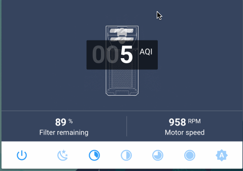
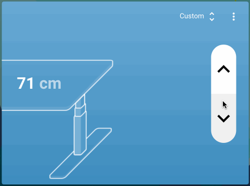
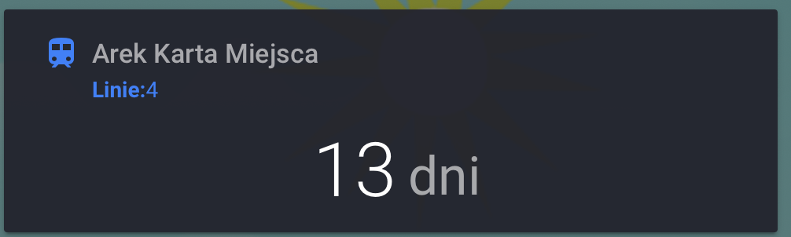
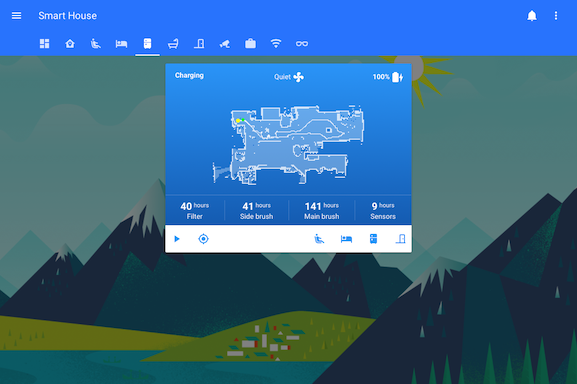
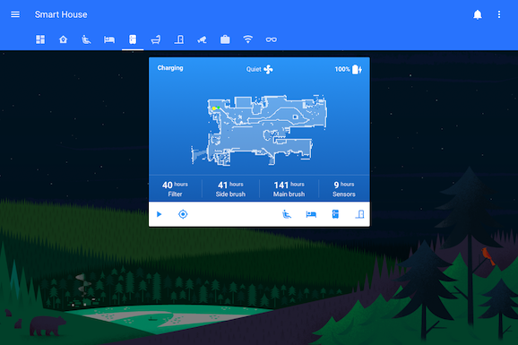
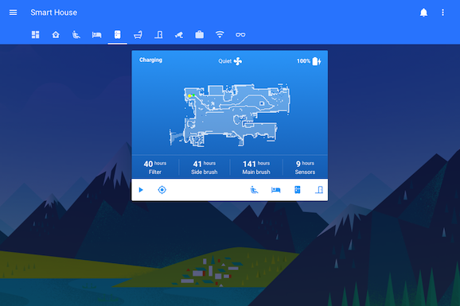

## Vacuum


[More info here](/SmartHouse/HomeAssistant/Vacuum/)

## Air Purifier


[air-purifier](https://github.com/macbury/SmartHouse/tree/master/home-assistant/www/custom-lovelace/air-purifier) displays custom ui for the Xiaomi Air Purifier. There is a information about current AQI, speed and special buttons that allows me to switch between sleep mode, auto mode, and setting favorite level with target speed.

```yaml
- type: custom:air-purifier-card
  entity: fan.living_room_air_purifier
```

## Linak Desk Card


[Linak Desk Card](https://github.com/macbury/SmartHouse/blob/master/home-assistant/www/custom-lovelace/linak-desk/card.js) is a much nicer fronted for [cover](https://www.home-assistant.io/components/cover.mqtt/) entity. I can prepare some presets for diffrent heights that are available through select box in top right corner.

```yaml
- type: custom:linak-desk
  entity: cover.desk
  height:
    min: 68
    max: 128
  presets:
    - target: 100
      label: 'Arek Praca'
    - target: 170
      label: 'Arek Majsterkowanie'
    - target: 120
      label: 'Ola Stanie'
    - target: 60
      label: 'Ola Praca'
```

## QR Card

[QR Card](https://github.com/macbury/SmartHouse/blob/master/home-assistant/www/custom-lovelace/qr-card/card.js) is used for generating locally QR codes. For example I use it for generating code that helps people connect to my guest network.

```yaml
- type: custom:qr-card
  code: WIFI:S:MyAwesomeWiFi;T:WPA;P:TOTAL_SECRET_PASSWORD>;;
```

## Public Transport Card


[Transit Card](https://github.com/macbury/SmartHouse/blob/master/home-assistant/www/custom-lovelace/transit/card.js) shows public transit schedules as readable table. I have two cards of this type, on the main dashboard page that tells me when next train to my work will be and on work page.

```yaml
- type: custom:transit-card
  entity: sensor.to_work_transit
```

## KKM Card


Simple companion card for kkm_sensor that displays how many days I have left on my train card before it expires and for what lines.

## dynamic-wallpaper

This lovelace extension changes background depending on current state of `sun.sun` entity.

```yaml
- type: custom:dynamic-wallpaper
  entity: sun.sun
```




