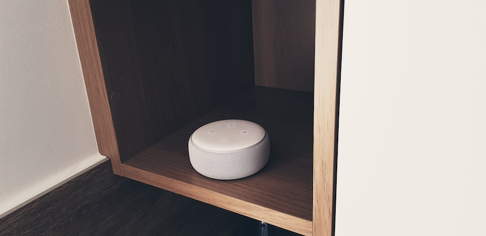

## Beginning with GoogleHome
At the beginning I tried to use [Google Home AIY Kit](https://aiyprojects.withgoogle.com/voice/) for voice controlling. Microphone was not bad, but it wasn't good(there was a lot situations that queries were not processed). First attempt was with [snips.ai](https://snips.ai/) and [modified code that could run it on Google AIY](https://github.com/macbury/snips-aiy) but quality of voice recognition was bad, and in situations with turned on TV or playing music it just didn't work. [Next attempt](https://github.com/macbury/aiyprojects-raspbian) used [Google DialogFlow SDK](https://dialogflow.com/) for processing intents and [Amazon Polly](https://aws.amazon.com/polly/) for audio responses(codename for project was Frankenstein Monster) but I was limited to only my implemented commands.

<iframe width="960" height="315" src="https://www.youtube-nocookie.com/embed/1rA9xihNHfs" frameborder="0" allow="accelerometer; autoplay; encrypted-media; gyroscope; picture-in-picture" allowfullscreen></iframe>

## Switching to Alexa
My current setup uses 3 alexa devices placed in living room, kitchen and bedroom. My home assistant instance is glued with alexa using [default alexa integration](https://www.home-assistant.io/components/alexa/) that points to private AWS lambda. To increase privacy and security not all entities are exposed to Alexa Cloud(only lights, few switches, media player and living room blinds). For sending notifications and to control echo dots there is [alexa_media_player](https://github.com/keatontaylor/alexa_media_player) custom component. I use it for sending voice notifications and to periodically clear voice history.

